# Development Guide

This document provides detailed information for developers who want to understand or modify the vinyl player codebase.

## Project Structure

```
<project-folder>/
├── include/                    # Header files (public interfaces)
│   ├── AudioPlayer.h          # DFPlayer PRO wrapper
│   ├── RFIDReader.h           # RC522 RFID reader wrapper
│   ├── CardRouter.h           # UID to track mapping
│   └── README                 # PlatformIO include folder info
├── src/                       # Implementation files
│   ├── main.cpp              # Application entry point and main loop
│   ├── AudioPlayer.cpp       # DFPlayer PRO implementation
│   ├── RFIDReader.cpp        # RC522 RFID reader implementation
│   ├── CardRouter.cpp        # UID/track mapping implementation
│   └── TrackMapper.cpp       # Legacy file (can be removed)
├── lib/                       # External libraries (if any local)
│   └── README                # PlatformIO lib folder info
├── test/                      # Unit tests (future expansion)
│   └── README                # PlatformIO test folder info
├── platformio.ini            # Build configuration
├── README.md                 # Project overview and setup
├── SETUP_GUIDE.md            # Step-by-step setup instructions
├── LIBRARY_PATCH.md          # DFRobot library compatibility patch
└── DEVELOPMENT.md            # This file
```

## Module Architecture

```
┌─────────────────┐
│   main.cpp      │  (Application logic, state machine)
│                 │
├─────────────────┤
│  RfidReader     │  ┌──────────────┐
│  AudioPlayer    │──│ CardRouter   │
│                 │  └──────────────┘
├─────────────────┤
│  MFRC522 lib    │
│  DFRobot lib    │
│  Arduino core   │
└─────────────────┘
```

### Data Flow

```
Hardware (RFID card placed)
         ↓
    RfidReader.readCard()
         ↓
    String UID "AA:BB:CC:DD"
         ↓
    CardRouter.trackForUID()
         ↓
    uint16_t track (1-9999 or 0)
         ↓
    AudioPlayer.playTrack()
         ↓
    Serial1 AT command
         ↓
Hardware (DFPlayer plays track)
```

## Detailed Module Descriptions

### RFIDReader (RC522 Control)

**Purpose:** Abstraction layer for MFRC522 RFID reader

**File:** `include/RFIDReader.h`, `src/RFIDReader.cpp`

**Key implementation details:**

1. **Initialization:**
   ```cpp
   void RfidReader::begin() {
     SPI.begin();              // Initialize SPI0 bus
     _mfrc522.PCD_Init();      // Initialize RC522 chip
   }
   ```

2. **Card reading (continuous detection):**
   ```cpp
   bool RfidReader::readCard(String &uidOut) {
     // Check for new card
     if (!_mfrc522.PICC_IsNewCardPresent()) return false;
     
     // Read card serial number
     if (!_mfrc522.PICC_ReadCardSerial()) return false;
     
     // Build UID string "AA:BB:CC:DD"
     for (byte i = 0; i < _mfrc522.uid.size; i++) {
       // ... format bytes ...
     }
     
     // CRITICAL: Don't halt the card!
     _mfrc522.PCD_StopCrypto1();  // ← No PICC_HaltA() call
     // This allows the same card to be read again on next loop
     
     return true;
   }
   ```

3. **Why no PICC_HaltA()?**
   - Normal RFID applications: Halt card after reading → prevents re-reading
   - Vinyl player use case: Don't halt → allows continuous detection
   - When card is removed, subsequent `PICC_IsNewCardPresent()` returns false
   - This creates the "card removed" detection we need

**Design decisions:**
- SPI0 uses default Pico pins (16, 18, 19) for hardware SPI
- SS and RST pins are configurable (passed to constructor)
- Returns formatted UID strings (easier to work with than byte arrays)

### AudioPlayer (DFPlayer PRO Control)

**Purpose:** Abstraction layer for DFPlayer PRO using AT commands

**File:** `include/AudioPlayer.h`, `src/AudioPlayer.cpp`

**Key implementation details:**

1. **Initialization sequence:**
   ```cpp
   bool AudioPlayer::begin() {
     // 1. Configure Serial1 pins (flexible on Pico)
     Serial1.setTX(_txPin);
     Serial1.setRX(_rxPin);
     Serial1.begin(115200);  // Fixed baud rate for DFPlayer PRO
     
     delay(1000);  // Wait for DFPlayer boot
     
     // 2. Disable voice announcements
     sendATCommand("AT+PROMPT=OFF");
     
     // 3. Switch to music mode
     sendATCommand("AT+FUNCTION=MUSIC");
     
     // 4. Enable single-track looping
     sendATCommand("AT+PLAYMODE=1");
     
     // 5. Set initial volume
     setVolume(15);
     
     return true;
   }
   ```

2. **AT command format:**
   ```cpp
   void AudioPlayer::sendATCommand(const String& cmd) {
     Serial1.println(cmd);  // println adds \r\n (required by DFPlayer)
     delay(50);             // Wait for command to process
   }
   ```

3. **Track playback:**
   ```cpp
   void AudioPlayer::playTrack(uint16_t track) {
     // Convert track number to filename: 1 → /0001.mp3
     String filename = "/";
     if (track < 10) filename += "000";
     else if (track < 100) filename += "00";
     else if (track < 1000) filename += "0";
     filename += String(track) + ".mp3";
     
     // Play the file
     playFile(filename);
     
     // Re-enforce loop mode (workaround for DFPlayer state management)
     delay(100);
     sendATCommand("AT+PLAYMODE=1");
   }
   ```

**AT Commands Reference:**

| Command | Purpose | Example |
|---------|---------|---------|
| `AT+FUNCTION=MUSIC` | Switch to music mode | One-time setup |
| `AT+PLAYMODE=1` | Loop single track infinitely | After each play |
| `AT+PLAYMODE=0` | Play once then stop | Alternative mode |
| `AT+VOL=n` | Set volume (0–30) | `AT+VOL=15` |
| `AT+PLAYFILE=/0001.mp3` | Play specific file | File-based playback |
| `AT+PLAY=PP` | Toggle play/pause | Warning: needs state tracking |
| `AT+PROMPT=OFF` | Disable voice prompts | Removes "music" announcement |

**Design decisions:**
- Use AT commands (not DFRobot library) for cleaner Pico 2 compatibility
- Re-enforce `PLAYMODE=1` on each track play (state management workaround)
- Use `setVolume(0)` instead of toggle pause (prevents toggle bugs)
- `Serial1.begin(115200)` is mandatory (not configurable)

### CardRouter (UID → Track Mapping)

**Purpose:** Simple mapping from RFID card UID to track number

**File:** `include/CardRouter.h`, `src/CardRouter.cpp`

**Implementation:**
```cpp
uint16_t trackForUID(const String &uid) {
  // Lookup table using if-statements
  if (uid == "C1:98:CC:E4") return 6;   // Card plays track 6
  if (uid == "B1:A0:CC:E4") return 2;   // Card plays track 2
  
  // Unknown card
  return 0;  // Return 0 for unknown cards (prevents playback)
}
```

**Extensibility options for larger card sets:**

If you have many cards, consider these alternatives:

1. **HashMap (requires additional library):**
   ```cpp
   #include <map>
   std::map<String, uint16_t> cardMap = {
     {"C1:98:CC:E4", 6},
     {"B1:A0:CC:E4", 2}
   };
   ```

2. **Array-based lookup (if UIDs follow pattern):**
   ```cpp
   uint16_t cardTracks[] = {6, 2, 3, ...};  // Index maps to card
   ```

3. **EEPROM storage (persistent across reboots):**
   - Store card mappings in Pico's EEPROM
   - Update via Serial command interface

**Current design trade-offs:**
- ✅ Simple and easy to understand
- ✅ Compile-time checked
- ❌ Not scalable for 100+ cards
- ❌ Requires recompile to add cards

### main.cpp (Application Logic)

**Purpose:** Application entry point, initialization, and main loop

**File:** `src/main.cpp`

**Key state variables:**
```cpp
// RFID state
String currentUID;           // Last detected card UID
String lastUID;             // Previously detected UID (debounce)

// Playback state
bool isPlaying;             // Currently playing music?
uint8_t missedReads;        // Counter for card removal detection

// Volume state
uint8_t lastVolume;         // Last set volume (for potentiometer changes)
```

**Main loop flow:**

```mermaid
graph TD
    A["🔄 Start Loop"] --> B["Read Potentiometer<br/>ADC0 GP26"]
    B --> C{"Volume<br/>Changed?"}
    C -->|Yes| D["Update Volume"]
    C -->|No| E["Poll RFID Reader<br/>readCard()"]
    D --> E
    
    E --> F{"Card<br/>Detected?"}
    F -->|No| G["missedReads++"]
    G --> H{"missedReads ><br/>REMOVAL_THRESHOLD?"}
    H -->|Yes| I{"isPlaying<br/>== true?"}
    I -->|Yes| J["audio.pause()"]
    J --> K["isPlaying = false"]
    H -->|No| K
    I -->|No| K
    K --> L["Return to Loop"]
    
    F -->|Yes| M["missedReads = 0"]
    M --> N{"Same UID<br/>as last?"}
    N -->|Yes| L
    N -->|No| O["Call trackForUID()"]
    
    O --> P{"Track<br/>== 0?"}
    P -->|Yes| Q["Unknown Card"]
    Q --> R["audio.pause()"]
    P -->|No| S["audio.playTrack(track)"]
    
    R --> T["Update lastUID"]
    S --> T
    T --> U["isPlaying = true"]
    U --> L
    
    L --> V["🔄 Loop Delay ~10ms"]
    V --> A
    
    style A fill:#90EE90
    style L fill:#FFB6C6
    style V fill:#87CEEB
    style Q fill:#FFD700
    style S fill:#98FB98
```



Key decision points:
- **Card read?** - No: increment missed reads counter
- **Same UID?** - Yes: debounce (prevent rapid retriggers)
- **Track 0?** - Yes: unknown card, pause music
- **Volume changed?** - Yes: update DFPlayer volume

**Debouncing strategy:**
```cpp
const uint8_t REMOVAL_THRESHOLD = 5;  // Consecutive missed reads

// In loop:
if (!rfid.readCard(uid)) {
  missedReads++;
  if (missedReads > REMOVAL_THRESHOLD && isPlaying) {
    // Card considered removed
    audio.pause();
    isPlaying = false;
  }
  return;  // Continue to next loop iteration
}

// Card successfully read
missedReads = 0;  // Reset counter
```

**Why debouncing matters:**
- RFID readers can have intermittent reads during card removal
- False "card removed" detection causes music to stutter
- Threshold of 5 missed reads = ~500ms delay before considering card removed
- Balances responsiveness vs reliability

## Build System (PlatformIO)

### platformio.ini Configuration

```ini
[env:pico2]
platform = https://github.com/maxgerhardt/platform-raspberrypi.git
board = rpipico2
framework = arduino
board_build.core = earlephilhower

lib_deps =
  miguelbalboa/MFRC522 @ ^1.4.11
  dfrobot/DFRobot_DF1201S

monitor_speed = 115200
monitor_port = COM6  ; Adjust to your port
```

**Key settings explained:**

| Setting | Purpose |
|---------|---------|
| `platform = https://...` | Max Gerhardt's custom Pico platform (required) |
| `board = rpipico2` | Specifies Raspberry Pi Pico 2 target |
| `framework = arduino` | Use Arduino framework |
| `board_build.core = earlephilhower` | Use earlephilhower's Arduino-Pico core |
| `lib_deps` | Auto-download these libraries |
| `monitor_speed = 115200` | Serial monitor baud rate |
| `monitor_port` | Serial port (optional, auto-detect if omitted) |

### Build Targets

```bash
# Build only
pio run -e pico2

# Build and upload (if connected)
pio run -e pico2 -t upload

# Clean and rebuild
pio run -e pico2 --target clean

# Monitor serial output
pio device monitor --port COM6 --baud 115200
```

## Debugging

### Serial Output

All modules use `Serial` for debug output at **115200 baud**:

```cpp
// In RFIDReader.cpp
Serial.println("RfidReader: RC522 initialized");

// In AudioPlayer.cpp
Serial.println("AudioPlayer: initializing DFPlayer PRO...");

// In main.cpp
Serial.println("Card detected: " + uid);
```

### Common Debug Techniques

1. **Check if card is being read:**
   ```cpp
   if (rfid.readCard(uid)) {
     Serial.println("DEBUG: Card UID = " + uid);
   } else {
     Serial.println("DEBUG: No card detected");
   }
   ```

2. **Check audio player state:**
   ```cpp
   Serial.print("DEBUG: Audio ready? ");
   Serial.println(audio.isReady() ? "YES" : "NO");
   ```

3. **Monitor debounce counter:**
   ```cpp
   Serial.print("DEBUG: Missed reads = ");
   Serial.println(missedReads);
   ```

4. **Log volume changes:**
   ```cpp
   int currentVol = map(analogRead(POT_PIN), 0, 1023, MIN_VOLUME, MAX_VOLUME);
   Serial.print("DEBUG: Volume = ");
   Serial.println(currentVol);
   ```

### Using the Serial Monitor

1. Open in VS Code: PlatformIO → Serial Monitor (or Ctrl+Alt+M)
2. Set baud to **115200**
3. View real-time debug output
4. Don't forget to reset Pico after opening monitor

## Memory Considerations

### RAM Usage

Approximate RAM usage on Pico 2 (264 KB total):

| Component | RAM Usage |
|-----------|-----------|
| Arduino core | ~30 KB |
| Serial (2 UARTs) | ~2 KB |
| Libraries (SPI, I2C) | ~5 KB |
| String objects (UIDs, etc.) | ~2 KB |
| Application variables | <1 KB |
| **Total estimated** | **~40 KB** |

**Remaining:** ~224 KB free (plenty for expansion)

### Flash Usage

Approximate flash (ROM) on Pico 2 (4 MB total):

| Component | Flash Usage |
|-----------|-----------|
| Arduino core | ~300 KB |
| Libraries | ~100 KB |
| Application code | ~50 KB |
| **Total estimated** | **~450 KB** |

**Remaining:** ~3.5 MB free (lots of room for additional features)

**No memory constraints for this project.**

## Testing

### Manual Testing Checklist

- [ ] RFID reader detects and reads cards
- [ ] Card UIDs are correctly formatted
- [ ] Audio player initializes without errors
- [ ] Music plays when card is presented
- [ ] Music pauses when card is removed
- [ ] Volume control responds to potentiometer
- [ ] Unknown cards don't trigger playback
- [ ] Same card can be read multiple times
- [ ] System recovers from errors gracefully

## References

- Arduino-Pico documentation: https://github.com/earlephilhower/arduino-pico
- MFRC522 library: https://github.com/miguelbalboa/rfid
- DFRobot DF1201S: https://www.dfrobot.com/product-2329.html
- Raspberry Pi Pico datasheet: https://datasheets.raspberrypi.com/pico/pico-datasheet.pdf

---

**Last Updated:** December 2025  
**Status:** Complete documentation for development
